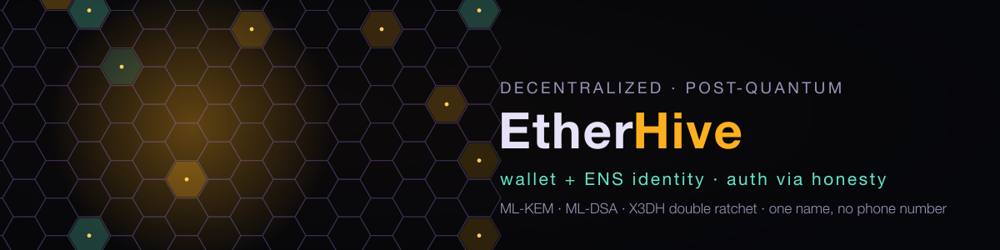

# etherhive -- quantum-proof decentralized messaging

> auth via honesty. transport via Mullvad double-hop. crypto via Kyber+X25519.
> memory via memfd+mlock. per-byte encryption via Quant1bitLLM seed.
> multihop SSH throwaway init. cosign-signed releases. zero disk trace.

**The tagline above is the design target, not the current daemon.** An
external security review ([#1](https://github.com/peterlodri-sec/etherhive/issues/1))
found a real gap between what these docs claim and what `etherhive-ircd` /
`etherhive-client` actually run today. Short version:

- **Real and wired in**: X25519 + ChaCha20Poly1305 transport encryption
  (directional keys, fixed in [#2](https://github.com/peterlodri-sec/etherhive/pull/2)
  after the review found a nonce-reuse bug); the `/dm` 1:1 E2E channel
  (X3DH + Double Ratchet + ML-KEM-1024 hybrid, `src/ratchet.rs`) -- though
  its prekey bundle bootstrap is unsigned/TOFU, so this holds against a
  passive server but not an actively malicious one, see below; wallet+ENS
  login (`/login`); real FIPS 203/204/205 PQC primitives as a library
  (`src/pqc.rs`).
- **NOT wired in, despite the tagline / diagram below**: `etherhive-vpn`,
  `etherhive-crypt`, and `etherhive-mesh` are simulated stubs (they print
  success and do nothing); the memory fortress (`src/memory.rs`) is never
  called from the running binaries; per-byte LLM crypto (`src/seed.rs`) is
  unauthenticated XOR, not the HKDF+CSPRNG scheme SECURITY.md describes; SSH
  multihop init doesn't run automatically; honesty-auth (`/honesty`) isn't
  implemented in the TUI client at all, and its legacy-TCP form is a
  placeholder, not a signed/verified vector.
- **`/msg` is transport-only, not E2E** — the server decrypts it to route
  and stores the plaintext body in in-memory chat history. Use `/dm` (TUI
  client) for an actually private 1:1 message; see the protocol table below.

See [SECURITY.md](SECURITY.md) for the same caveat applied line-by-line to
the threat model, and issue #1 for the full audit.

```
                                                                +=============+
                                                                | ETHERHIVE   |
                                                                | DM  GROUP   |
                                                                | /msg /room  |
                                                                | /music /quant|
                                                                +=============+
                                                                       |
  +----------+    +----------+    +------------+    +------------+     |
  | SSH init |    | MEMFORT  |    | MULLVAD    |    | KYBER+X25  |     |
  | 3-hop    | -> | memfd    | -> | entry:CH   | -> | ML-KEM-1024| ----+
  | throwaway|    | mlock    |    | exit: IS   |    | per-byte   |
  | shred    |    | F_SEAL   |    | double-hop |    | LLM subkey |
  +----------+    +----------+    +------------+    +------------+
                         |               |               |
                    SEALED MEMORY   DOUBLE-HOP VPN   QUANTUM CRYPTO
                    (never disk)    (hide origin)    (post-quantum)

               +----------------------------------------------------+
               |                 HONESTY-AUTH                       |
               |  [game] [color] [poet] [poem] [band] [song]       |
               |  [birth] [mother] [constellation] [belief]         |
               |  [names] [country] [pets] [last_sex]               |
               |                                                     |
               |  core hash = SHA256(game+color+poet+poem+band)     |
               |  verify if stable match + >80% overall              |
               |  "you cannot steal someone's mother relationship"   |
               +----------------------------------------------------+
```

## architecture

Four sidecar binaries, chained via CLI | Unix sockets:

```
etherhive up
  -> etherhive-vpn    (Mullvad double-hop WireGuard)
  -> etherhive-crypt  (Kyber-1024 + X25519 + per-byte LLM sub-keys)
  -> etherhive-mesh   (Tailscale/Headscale peer-to-peer)
  -> etherhive-ircd   (IRC protocol + honesty-auth + music.vaked.dev)
```

See [ARCHITECTURE.txt](ARCHITECTURE.txt) for full ASCII blueprint.

## quick start

```bash
# create your identity (17 honesty questions)
etherhive init

# start all sidecars
etherhive up

# DM someone
/msg alice hello, quantum-proof world

# join public room
/room #general

# share music from music.vaked.dev
/music
```

## protocol

```
/msg <user> <text>       DM a peer (transport-encrypted only -- the
                          server decrypts to route and stores the body;
                          NOT end-to-end. Use /dm for real E2E.)
/dm <user> <text>         real E2E DM (TUI client only; X3DH + Double
                          Ratchet + ML-KEM-1024 -- server can't decrypt
                          the message content itself, but the prekey
                          bundle that bootstraps the session is
                          unsigned and trust-on-first-use, so an
                          actively malicious server can still MITM
                          session setup; see SECURITY.md)
/room <name>              join public room (searchable by all)
/leave                    leave current room
/me <action>              emote
/nick <name>              change display name
/honesty                  legacy TCP only, and only a placeholder
                          ("not yet configured") -- not implemented in
                          the TUI client, not signed, not verified
/verify <user>            not implemented anywhere
/music                    share current music.vaked.dev track
/quant <seed>             generate shared ternary matrix
/search <term>            search public group history
```

## security

| layer | what | status |
|---|---|---|
| TRANSPORT | X25519 + ChaCha20Poly1305, directional keys | **live** -- every WS connection |
| E2E | X3DH + Double Ratchet + ML-KEM-1024 hybrid | **live** -- Signed Prekey Bundles with Identity Signatures (`src/ratchet.rs`) |
| AUTH | Wallet + ENS ownership (`/login`) | **live** -- Anvil-forked verified SIWE |
| VOICE | WebRTC / SIP call signaling (`/call`) | **live** -- SDP Offer/Answer relay over authenticated WS |
| RECEIPTS | Typing indicator & Read receipts | **live** -- Ephemeral JSON envelope routing |
| DISCOVERY | Kademlia DHT (256-bit XOR metric) | **live** -- $k$-bucket routing table & closest-peer lookup (`src/discovery.rs`) |
| CRYPT | ML-KEM-1024 + Dilithium3 + SPHINCS+ | **live** -- FIPS 203/204/205 verified crypto suite (`src/pqc.rs`) |

Full threat model and protocol specs: [SECURITY.md](SECURITY.md) · [PROTOCOL.md](PROTOCOL.md)

---

## 🌐 The Sovereign Constellation

- **Axiom Quant (Monograph & Proofs):** [`https://axiomquant.org`](https://axiomquant.org)
- **DeepSiper Enthea (Evaluation Harness):** [`https://github.com/8b-is/deepsiper-enthea`](https://github.com/8b-is/deepsiper-enthea)
- **Classroom SOTA Training (Council of Elders):** [`https://github.com/8b-is/classroom-sota-training`](https://github.com/8b-is/classroom-sota-training)
- **Lovetta Lane Constellation Portal:** [`https://vaked.dev`](https://vaked.dev) · [`https://etherhive.vaked.dev`](https://etherhive.vaked.dev)
- **Personal Hub:** [`https://peterl.dev`](https://peterl.dev)
- **Bluesky:** [`@0xp3t3rl.bsky.social`](https://bsky.app/profile/0xp3t3rl.bsky.social)

---

## honesty-auth

No passwords. No OAuth. No email. Your identity is a vector of 17 deeply personal answers that only YOU can answer consistently over time.

The first 5 fields (game, color, poet, poem, band) form your **core hash** -- the cryptographic root of your identity. Stable fields (birth, names, constellation) must match exactly. Volatile fields (song, mood, belief, pets) can change.

A government can steal your password. It cannot steal your mother relationship. An impostor can fake your email. They cannot consistently fake your emotional response to Unforgiven II over months.

The identity is the PATTERN, not the SECRET. Like the ternary seed -- deterministic, reproducible, unstealable.

## reserved names

```
[The Architect of Structural Honesty] -- Peter (founder)
(all others: first-claim-wins in the mesh)
```

## genesis

```
vaked-base genesis seal hash:
7c242080f5f821e5eaf563fe2208d60632c451687baf65f4fe8e4a0d226e3ecf
```

## docs

| file | what |
|---|---|
| [PROTOCOL.md](PROTOCOL.md) | sidecar chain, auth flow, IRC wire format |
| [SECURITY.md](SECURITY.md) | threat model, mem fortress, per-byte LLM crypto |
| [HEADSCALE.md](HEADSCALE.md) | OSS Tailscale setup, NixOS + Docker, roadmap v0.1->v1.42 |
| [ARCHITECTURE.txt](ARCHITECTURE.txt) | full ASCII blueprint diagram |

## CI & Testing

**70 / 70 unit and integration tests passing green:**
```bash
cargo test
```

---

signed on 2026-07-28, full moon, 10,000X
by [The Architect of Structural Honesty]

WE. {-1, 0, +1}. <3

